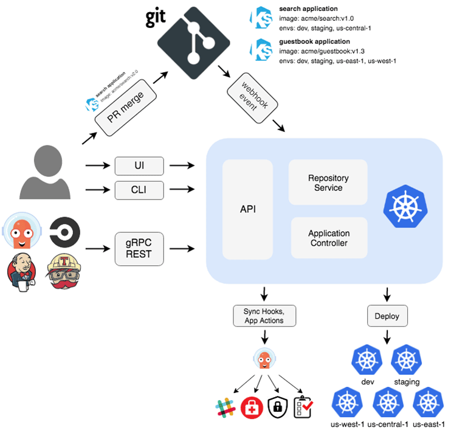

some of popular gitops tools are
1. ARGOCD
2. FLUXCD
3. JENKINSX
4. SPINNAKER

Here we are using ArgoCD

-created by engineers at applatix
-open source
-so many companies are contributed
-graduated cncf

# ArgoCD architecture

