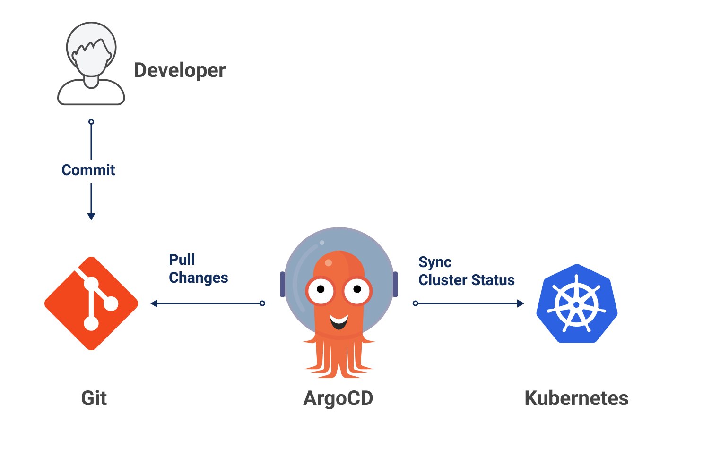

# GitOps

GitOps uses a git as single source of truth to delivery the applications and managing the infrastructure.

let's consider a devops engineer he/she is changing the kubernetes menifests file by using the gitops controller tool like ARGOCD it will reads about the changes in kubernetes files and create a resources in the kubernetes cluster and it can be following the both pull mechanisim and push mechanisim.

It will solving the main problem of tracking the changes.

# Advantages of GitOps tools..

1.Security
2.versioning(track the changes)
3.auto updates
4.auto healing of any unwanted changes
# flow chart
 

